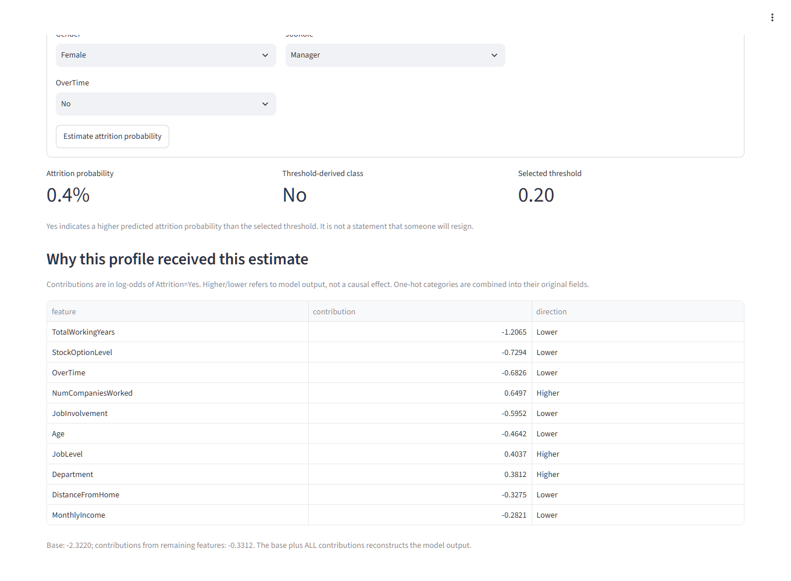
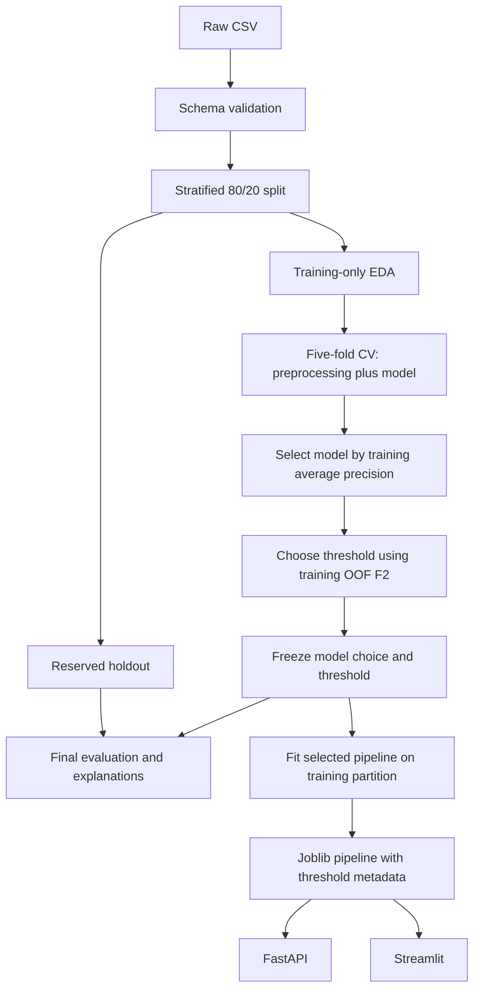

# Employee Attrition ML

[](https://github.com/hansdarmawann/ibmhratt/actions/workflows/ci-cd.yml)

An end-to-end Python portfolio project that estimates employee attrition probabilities, compares interpretable and tree-based models, and serves the saved pipeline through FastAPI and Streamlit. Model selection and threshold tuning use training data; a reserved holdout provides final evaluation.

**Educational analysis only. This project must not be used as an automated system for firing, promotion, hiring, disciplinary action, or other high-impact employment decisions.** Outputs are analytical signals, not causal evidence or reliable forecasts for individuals.



## Highlights

- **Leakage-safe evaluation.** A stratified holdout is reserved before any exploration, every learned transform is fitted inside cross-validation folds, and the model and its threshold are chosen on training data only. The holdout is scored once, with bootstrap intervals.
- **Diagnostics that do not move the goalposts.** Nested cross-validation of the whole selection procedure, calibration, seed stability, capacity and lift, sensitive-attribute and engineered-feature ablations, and subgroup metrics with intervals. None of them changes the served model.
- **Reproducible artifacts.** Each training run produces a checksummed, versioned bundle behind an atomic active-run pointer, and CI checks that committed reports match a fresh run.
- **Serving.** A FastAPI service (single and batch prediction, model info, request IDs, optional API key), a Streamlit dashboard with per-profile explanations, and PSI checks for input drift.
- **Delivery.** CI on Ubuntu and Windows runs lint, type checks, tests with a coverage gate, notebooks, and live services; dependencies and the image are scanned, actions are pinned to commit SHAs, and the tested image is published to GHCR.

## Quickstart

```bash
conda env create -f environment.yml && conda activate ibmhratt
python -m attrition.models.train               # validate data, compare models, save the pipeline and reports
python -m pytest -q                            # unit and integration tests
python -m uvicorn app.api:app --port 8000      # API docs at http://127.0.0.1:8000/docs
python -m streamlit run app/streamlit_app.py   # dashboard at http://localhost:8501
```

## Model comparison: executed results

This block is regenerated by the training CLI from actual metrics. Full details are in [model_metrics.json](reports/metrics/model_metrics.json), [fold-level metrics](reports/metrics/cv_fold_metrics.csv), and [results.md](reports/results.md).

<!-- RESULTS:START -->

| Model | CV AP (mean ± SD) | Test AP | Test ROC-AUC | Precision | Recall | F1 |
|---|---:|---:|---:|---:|---:|---:|
| dummy | 0.162 ± 0.000 | 0.160 | 0.500 | 0.000 | 0.000 | 0.000 |
| logistic_regression | 0.651 ± 0.061 | 0.584 | 0.812 | 0.615 | 0.340 | 0.438 |
| logistic_balanced | 0.606 ± 0.082 | 0.561 | 0.803 | 0.349 | 0.638 | 0.451 |
| random_forest | 0.552 ± 0.058 | 0.436 | 0.789 | 0.524 | 0.468 | 0.494 |
| hist_gradient_boosting | 0.604 ± 0.045 | 0.542 | 0.796 | 0.786 | 0.234 | 0.361 |

Table classification metrics use threshold 0.50. AP is average precision, not trapezoidal PR area.

Selected **logistic_regression** at threshold **0.20**, chosen by maximum F2 on training out-of-fold predictions.

At the frozen operating threshold, holdout AP = **0.584**, ROC-AUC = **0.812**, precision = **0.423**, recall = **0.638**, F1 = **0.508**.

95% stratified bootstrap intervals (1,000 holdout resamples, frozen model and threshold): AP [0.460, 0.711], ROC-AUC [0.734, 0.883], precision [0.333, 0.517], recall [0.489, 0.766], F1 [0.404, 0.607]. They reflect holdout sampling variability only, not split or model-selection variability.

- True positives: 30 observed attrition cases flagged.
- True negatives: 206 observed retention cases not flagged.
- False positives: 41 observed retention cases flagged.
- False negatives: 17 observed attrition cases missed.

Selection uses only five-fold training average precision. Prefer unweighted, then balanced logistic regression when within 0.01 AP of the best non-dummy model, for interpretability and simpler operation. Otherwise use the highest mean AP. Best AP candidate: logistic_regression; selected: logistic_regression. This rule was fixed before holdout evaluation.

OOF threshold scores reuse the training folds used for model comparison and are selection diagnostics, not an unbiased performance estimate. The holdout is evaluated after choices are frozen. There are 47 positive holdout examples, so small count changes materially affect recall.

### Additional findings

1. Training outer-OOF Brier score: uncalibrated **0.090**, sigmoid **0.093**; log loss **0.321** versus **0.321**. Calibration is diagnostic only; serving probabilities are unchanged.
2. Across training CV seeds 42, 43, and 44, selections were **{'logistic_regression': 3}**, with thresholds from **0.15** to **0.20**. Seed 42 remains the main experiment.
3. The highest-scored 10% of holdout profiles (30 rows) have precision **0.633**, recall **0.404**, and lift **3.96**. This is a capacity diagnostic, not an intervention policy.
4. Nested CV (5 outer training folds) estimates the whole selection procedure at AP **0.651 ± 0.061**, versus **0.651** ordinary CV AP for the selected model. Tuning small prespecified grids gives **0.646 ± 0.048**. Both are diagnostics; the served model is unchanged.
5. Five prespecified engineered features change logistic CV AP by **+0.014** (higher in 4 of 5 folds); the prespecified adoption rule is **met**. They are not used by the served model.

<!-- RESULTS:END -->


## Project architecture



`Pipeline` contains missing-value normalization, a `ColumnTransformer`, and the estimator. Numeric values use median imputation and scaling for logistic regression. Categorical values use most-frequent imputation and `OneHotEncoder(handle_unknown="ignore")`. Every CV fold independently fits all learned transforms. The holdout is never used to fit preprocessors, select features, choose a model, or tune the threshold.

## Documentation

| Guide | Contents |
|---|---|
| [Data and methodology](docs/methodology.md) | Business problem, dataset and exclusions, EDA, model comparison, threshold selection, explainability, training diagnostics, limitations |
| [Responsible AI](docs/responsible-ai.md) | Sensitive attributes, subgroup metrics and their uncertainty, conditions for any real use |
| [Serving and operations](docs/serving.md) | API with example responses, dashboard, Docker, versioned bundles and pruning, drift checks |
| [Development](docs/development.md) | Installation, tests and the local quality gate, CI/CD, supply-chain pinning |

## Repository structure

```text
ibmhratt/
├── data/{raw,processed}/        # Canonical raw CSV and reproducible split/OOF manifests
├── .github/workflows/          # Cross-platform CI and tested image delivery to GHCR
├── docs/                       # Methodology, responsible AI, serving, and development guides
├── notebooks/                  # Four executed narrative exploration notebooks
├── src/attrition/              # Installable package (`pip install -e .`, included in requirements-dev.txt)
│   ├── config.py               # Paths, schema, seed, and shared settings
│   ├── data/                   # Loading, validation, training-only EDA
│   ├── features/               # Fold-fitted preprocessing; ablation-only engineered features
│   ├── models/                 # Train, evaluate, threshold, nested CV, explain, predict, prune
│   ├── monitoring/             # PSI input drift checks
│   └── visualization/          # Headless report figures
├── app/{api,streamlit_app}.py
├── models/                     # Verified runs/<UUID>/ bundles and atomic current.json; gitignored
├── reports/{figures,metrics}/  # Actual computed evidence, intended for Git
├── reports/results.md
├── examples/employee.json      # Complete sample API payload
├── scripts/                    # Quality gate, report comparison, notebooks, delivery and container checks
├── tests/                      # Data, leakage boundaries, nested CV, inference, API, drift, UI
├── environment.yml
├── requirements.txt            # Training dependencies; includes requirements-serving.txt
├── requirements-dev.txt        # Runtime plus tests, coverage, lint, type checking, notebook execution
├── requirements-explain.txt    # Optional SHAP dependency
├── requirements-lock.txt       # Exact package constraints from verified Conda run
├── Dockerfile
├── pyproject.toml              # Package metadata plus Ruff, mypy, pytest, and coverage settings
├── .pre-commit-config.yaml     # Optional local Ruff, mypy, and file hygiene hooks
└── Makefile
```

## Limitations

The data is a small, fictional, cross-sectional sample with no temporal validation, and a single holdout split is used. Scores are uncalibrated probability estimates, and associations are not causal. See [limitations and future work](docs/methodology.md#limitations-and-future-improvements).
