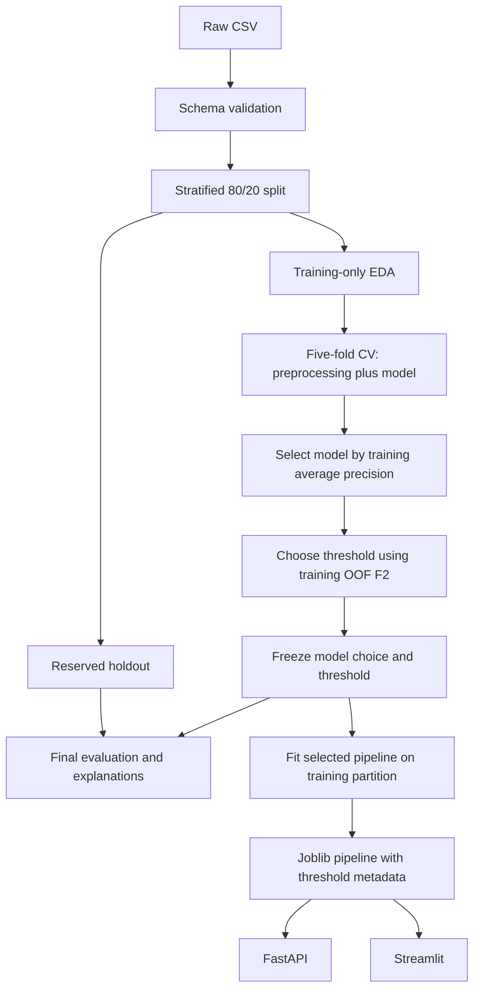
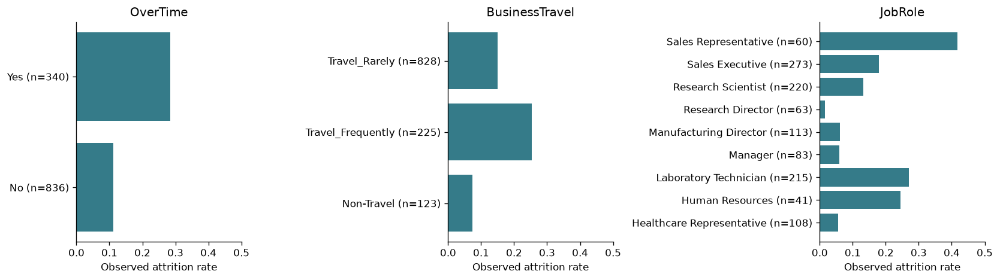
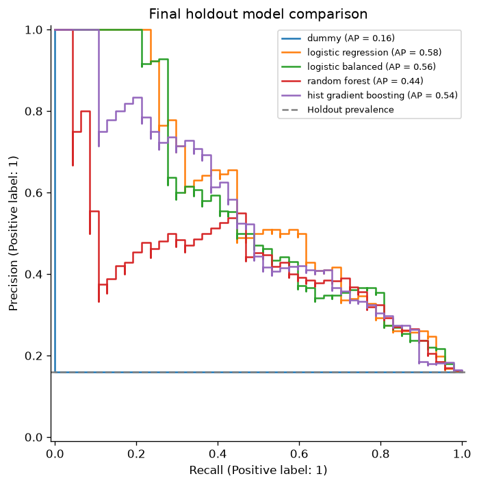

# Employee Attrition ML

[](https://github.com/hansdarmawann/ibmhratt/actions/workflows/ci-cd.yml)

An end-to-end Python portfolio project that estimates employee attrition probabilities, compares interpretable and tree-based models, and serves the saved pipeline through FastAPI and Streamlit. Model selection and threshold tuning use training data; a reserved holdout provides final evaluation.

**Educational analysis only. This project must not be used as an automated system for firing, promotion, hiring, disciplinary action, or other high-impact employment decisions.** Outputs are analytical signals, not causal evidence or reliable forecasts for individuals.

## Quickstart

```bash
conda env create -f environment.yml && conda activate ibmhratt
python -m src.models.train            # validate data, compare models, save the pipeline and reports
python -m pytest -q                   # unit and integration tests
python -m uvicorn app.api:app --port 8000      # API docs at http://127.0.0.1:8000/docs
python -m streamlit run app/streamlit_app.py   # dashboard at http://localhost:8501
```

## Business problem

Can available employee attributes distinguish observed attrition from retention? Which attributes contribute most to those model predictions? The workflow illustrates how an analyst might study retention-related patterns while recognizing uncertainty, sensitive attributes, and the costs of false positives and false negatives.

## Dataset

The supplied `WA_Fn-UseC_-HR-Employee-Attrition.csv` has 1,470 rows and 35 columns. Its target is `Attrition`: **Yes = 1**, **No = 0**. There are 237 Yes records and 1,233 No records (16.1% versus 83.9%). The [dataset publisher describes it as fictional data created by IBM data scientists](https://www.kaggle.com/datasets/pavansubhasht/ibm-hr-analytics-attrition-dataset). It does not establish real-world HR performance or a prediction horizon.

The canonical dataset is `data/raw/WA_Fn-UseC_-HR-Employee-Attrition.csv`; no root-level CSV is required. Loading validates all 35 columns, target labels, types, bounds, categories, duplicate rows/IDs, and constant assumptions. Missing predictors are reported and imputed within training folds; missing targets or entirely missing predictor columns fail clearly. The provided file contains no missing values or duplicate rows.

| Excluded feature | Reason confirmed on training rows |
|---|---|
| `EmployeeCount` | Constant 1 |
| `Over18` | Constant Y |
| `StandardHours` | Constant 80 |
| `EmployeeNumber` | Unique identifier, without portable predictive meaning |

The remaining 30 predictors are documented in `src/config.py`. Numeric bounds express broad schema constraints, not fitted dataset extrema. Ordinal ratings are treated numerically; the equal-spacing assumption is a limitation.

## Project architecture



`Pipeline` contains missing-value normalization, a `ColumnTransformer`, and the estimator. Numeric values use median imputation and scaling for logistic regression. Categorical values use most-frequent imputation and `OneHotEncoder(handle_unknown="ignore")`. Every CV fold independently fits all learned transforms. The holdout is never used to fit preprocessors, select features, choose a model, or tune the threshold.

## Repository structure

```text
ibmhratt/
├── data/{raw,processed}/        # Canonical raw CSV and reproducible split/OOF manifests
├── .github/workflows/          # Cross-platform CI and tested image delivery to GHCR
├── notebooks/                  # Four executed narrative exploration notebooks
├── src/
│   ├── config.py               # Paths, schema, seed, and shared settings
│   ├── data/                   # Loading, validation, training-only EDA
│   ├── features/preprocess.py  # Fold-fitted transformations
│   ├── models/                # Train, evaluate, threshold, explain, predict
│   └── visualization/         # Headless report figures
├── app/{api,streamlit_app}.py
├── models/                     # Verified runs/<UUID>/ bundles and atomic current.json; gitignored
├── reports/{figures,metrics}/  # Actual computed evidence, intended for Git
├── reports/results.md
├── examples/employee.json     # Complete sample API payload
├── scripts/                    # Notebook generation/execution
├── tests/                      # Data, leakage boundary, inference, API, UI
├── environment.yml
├── requirements.txt            # Training dependencies; includes requirements-serving.txt
├── requirements-dev.txt        # Runtime plus tests, coverage, lint, notebook execution
├── requirements-explain.txt    # Optional SHAP dependency
├── requirements-lock.txt       # Exact package constraints from verified Conda run
├── Dockerfile
├── pyproject.toml              # Ruff, pytest, and coverage settings
└── Makefile
```

## Installation: Conda `ibmhratt`

Run commands from the repository root. Python **3.12** is the verified runtime.

```bash
# Only if the environment does not already exist:
conda create -n ibmhratt python=3.12 pip -y
conda activate ibmhratt
python -m pip install -r requirements-dev.txt -c requirements-lock.txt
python -m src.models.train
python -m pytest -q
```

Alternatively, `conda env create -f environment.yml` creates the named environment using the same package constraints. `requirements-serving.txt` declares API/dashboard dependencies; `requirements.txt` includes those plus training plots. The Docker runtime installs only serving dependencies; `requirements-dev.txt` adds testing, linting, and notebook tools; the lock file pins the packages used for the recorded results. Use the constraints above when reproducing them. Platforms may install different platform-specific transitive dependencies.

If activation is inconvenient, use `conda run --no-capture-output -n ibmhratt python -m src.models.train`. In VS Code, select **Python (ibmhratt)** as the interpreter and notebook kernel. All project paths are derived from `src/config.py`, without machine-specific absolute paths.

Optional SHAP and executed notebooks:

```bash
python -m pip install -r requirements-explain.txt -c requirements-lock.txt
python -m src.models.train --with-shap
python -m scripts.execute_notebooks
```

The four notebooks cover data understanding, EDA, feature engineering, and model experiments. Training must run first because notebooks display its generated figures and metrics. Reusable logic lives in `src/`; `scripts/build_notebooks.py` regenerates notebook cell sources and clears their outputs.

## EDA highlights

EDA uses only the 1,176 training rows. The saved tables cover every predictor: category counts/rates, numeric summary statistics by target, missingness, IQR outlier counts, and numerical correlations. Overtime groups show different observed attrition rates; this is an association and does not show that overtime causes a departure. Income, job level, and career tenure variables overlap; a separate training-CV ablation investigates dropping `JobLevel`, `YearsInCurrentRole`, and `YearsWithCurrManager`.

Outliers are inspected rather than automatically trimmed. High income can correspond to senior roles, and IQR flags on bounded ratings are not evidence of data errors. No correlated variables are removed from the main candidates without a prespecified comparison.



## Modeling approach and evaluation

The fixed split and all applicable estimators use seed **42**. Five shuffled stratified folds compare a prior-based `DummyClassifier`, unweighted and balanced logistic regression, a constrained balanced random forest, and regularized histogram gradient boosting. No SMOTE or XGBoost dependency is required.

The primary comparison is **average precision (AP)**, labeled `pr_auc` in JSON. AP is a weighted summary of precision over recall increments, not trapezoidal area under the PR curve. Precision, positive-class recall, F1, ROC-AUC, confusion counts, and Brier score are also recorded. CV reports means and population standard deviations for AP, ROC-AUC, precision, recall, and F1. Accuracy is not a selection criterion.

The prespecified selection rule chooses the highest training CV AP, preferring unweighted logistic regression, then balanced logistic regression, if within 0.01 AP of the best candidate. This makes the interpretability/complexity tradeoff explicit. The diagnostic sensitive/correlated-feature ablations do not become additional candidates. Test results never change the rule.

## Model comparison: executed results

This block is regenerated by the training CLI from actual metrics. Full details are in [model_metrics.json](reports/metrics/model_metrics.json), [fold-level metrics](reports/metrics/cv_fold_metrics.csv), and [results.md](reports/results.md).

<!-- RESULTS:START -->

| Model | CV AP (mean ± SD) | Test AP | Test ROC-AUC | Precision | Recall | F1 |
|---|---:|---:|---:|---:|---:|---:|
| dummy | 0.162 ± 0.000 | 0.160 | 0.500 | 0.000 | 0.000 | 0.000 |
| logistic_regression | 0.651 ± 0.061 | 0.584 | 0.812 | 0.615 | 0.340 | 0.438 |
| logistic_balanced | 0.606 ± 0.082 | 0.561 | 0.803 | 0.349 | 0.638 | 0.451 |
| random_forest | 0.552 ± 0.058 | 0.436 | 0.789 | 0.524 | 0.468 | 0.494 |
| hist_gradient_boosting | 0.604 ± 0.045 | 0.542 | 0.796 | 0.786 | 0.234 | 0.361 |

Table classification metrics use threshold 0.50. AP is average precision, not trapezoidal PR area.

Selected **logistic_regression** at threshold **0.20**, chosen by maximum F2 on training out-of-fold predictions.

At the frozen operating threshold, holdout AP = **0.584**, ROC-AUC = **0.812**, precision = **0.423**, recall = **0.638**, F1 = **0.508**.

95% stratified bootstrap intervals (1,000 holdout resamples, frozen model and threshold): AP [0.460, 0.711], ROC-AUC [0.734, 0.883], precision [0.333, 0.517], recall [0.489, 0.766], F1 [0.404, 0.607]. They reflect holdout sampling variability only, not split or model-selection variability.

- True positives: 30 observed attrition cases flagged.
- True negatives: 206 observed retention cases not flagged.
- False positives: 41 observed retention cases flagged.
- False negatives: 17 observed attrition cases missed.

Selection uses only five-fold training average precision. Prefer unweighted, then balanced logistic regression when within 0.01 AP of the best non-dummy model, for interpretability and simpler operation. Otherwise use the highest mean AP. Best AP candidate: logistic_regression; selected: logistic_regression. This rule was fixed before holdout evaluation.

OOF threshold scores reuse the training folds used for model comparison and are selection diagnostics, not an unbiased performance estimate. The holdout is evaluated after choices are frozen. There are 47 positive holdout examples, so small count changes materially affect recall.

### Three additional findings

1. Training outer-OOF Brier score: uncalibrated **0.090**, sigmoid **0.093**; log loss **0.321** versus **0.321**. Calibration is diagnostic only; serving probabilities are unchanged.
2. Across training CV seeds 42, 43, and 44, selections were **{'logistic_regression': 3}**, with thresholds from **0.15** to **0.20**. Seed 42 remains the main experiment.
3. The highest-scored 10% of holdout profiles (30 rows) have precision **0.633**, recall **0.404**, and lift **3.96**. This is a capacity diagnostic, not an intervention policy.

<!-- RESULTS:END -->



## Threshold selection

The selected model generates training out-of-fold probabilities with the same five stratified folds. A grid from 0.05 through 0.95 includes all requested 0.20–0.50 operating points. The selected threshold maximizes **F2**, breaking ties by precision and then the higher threshold. [threshold_analysis.csv](reports/metrics/threshold_analysis.csv) includes precision, recall, F1/F2, false positives, and false negatives for every point.

F2 expresses an educational preference for recall; it is not an estimated dollar cost. A missed support opportunity could matter more than an unnecessary outreach, but that needs an agreed intervention policy and capacity constraints. A lower threshold increases the number of flagged records. The API and dashboard use the threshold bundled with the model, rather than defaulting to 0.50.

OOF threshold scores reuse the training folds used for model selection and can be optimistic. Final holdout metrics are reported separately, with 95% stratified bootstrap intervals for the selected model ([holdout_bootstrap_ci.csv](reports/metrics/holdout_bootstrap_ci.csv)). These intervals cover holdout sampling only, not split or selection variability. The saved pipeline remains fitted only on the training partition, preserving correspondence between the evaluated model and deployed demo.

## Explainability

The report includes human-readable logistic coefficients, random-forest impurity importance, and original-feature permutation importance measured as holdout AP decrease over ten shuffles. Numeric logistic coefficients represent a one-training-standard-deviation change; categorical coefficients act on encoded indicators. Full one-hot encoding and correlated predictors require cautious interpretation of individual coefficients.

Optional SHAP generates global importance, a beeswarm summary, and a waterfall for the first holdout record. Logistic SHAP contributions are in **log-odds**, not additive probability points; applying the logistic function to base value plus contributions recovers the model probability. SHAP uses a training background and at most 60 holdout examples. The dashboard also explains the submitted profile using the active bundle's training background, aggregates one-hot contributions to original fields, and displays the ten largest contributions plus the sum of remaining contributions. Tree explanations explicitly use probability units and are checked without a sigmoid transformation.

These explanations describe associations contributing to model predictions. Correlated features can share or mask importance. SHAP failure is isolated and recorded in the report; the core workflow retains coefficient and permutation explanations.

## Responsible AI considerations

Gender, Age, and MaritalStatus are retained in the educational main comparison. A prespecified logistic regression ablation removes all three and reports training CV metrics; its AP difference is in `sensitive_ablation` in the JSON report. This does **not** establish whether those attributes are acceptable for an actual HR application.

[Subgroup metrics](reports/metrics/subgroup_metrics.csv) report sample counts, positive counts, recall, false-positive rate, precision, and selection rate by Gender, MaritalStatus, and AgeBand. Small subgroups produce uncertain estimates; no confidence intervals or formal fairness certification are claimed. Excluding sensitive attributes alone cannot eliminate proxies such as job role, compensation, and tenure.

Real use would require a support-oriented purpose, consent/privacy controls, a governance review, human oversight, appropriate fairness definitions, independent validation, and monitoring. No real employee data should be entered into this demo. Model signals must not determine high-impact employment actions.

## API usage

```bash
python -m uvicorn app.api:app --host 127.0.0.1 --port 8000
```

Visit `http://127.0.0.1:8000/docs` for the complete Pydantic/OpenAPI schema. `GET /` describes the service; `GET /health` returns status and model availability, with HTTP 503 if the artifact cannot load. `POST /predict` accepts a single employee object with all 30 predictor keys. Numeric fields are strict whole numbers with bounds; categories are nonempty strings. Fields can explicitly be null for imputation, but missing or extra keys fail with HTTP 422. Novel categories are accepted and encoded as unseen values; they may reduce reliability.

```bash
curl -X POST http://127.0.0.1:8000/predict -H "Content-Type: application/json" --data-binary @examples/employee.json
```

PowerShell equivalent:

```powershell
Invoke-RestMethod -Uri http://127.0.0.1:8000/predict -Method Post -ContentType 'application/json' -Body (Get-Content examples/employee.json -Raw)
```

Responses contain `prediction` (Yes/No), `attrition_probability`, `threshold`, and nullable `run_id`, populated from the actual model. Health responses also identify the loaded run; explicit legacy schema-1 artifacts return null. No mock probabilities are served. The Python module accepts a dictionary or DataFrame and returns `predicted_class`, `attrition_probability`, `decision_threshold`, and nullable `run_id`; a DataFrame yields a list in row order.

```bash
python -m src.models.predict examples/employee.json
```

The model loads once during API startup; restart after retraining. Requests log event/count information without raw profiles. Joblib artifacts must come from a trusted source because pickle-based loading can execute code. This local demo does not implement authentication or production access controls.

## Streamlit usage

```bash
python -m streamlit run app/streamlit_app.py
```

Open `http://localhost:8501`. Tabs cover project/dataset overview, training-only EDA, model performance, an editable prediction form, feature importance, model explanation, and responsible ML. The form displays estimated probability first, its threshold-derived class, and the frozen operating threshold. Resources refresh when the active run changes. Model, report, plots, sample input, and explanation background are read from that same verified run.

## Docker usage

```bash
docker build -t employee-attrition-ml .
python -m scripts.verify_container --image employee-attrition-ml
docker run --rm -p 127.0.0.1:8000:8000 employee-attrition-ml
```

The multi-stage Python 3.12 slim image trains and verifies a bundle in its builder stage. The final stage installs constrained serving dependencies and copies the verified bundle and serving code. It contains no raw training dataset or training CLI and runs as an unprivileged user with a health check. Building requires a running Linux-container Docker engine and dependency-download access. SHAP is optional and omitted from the default image build.

## Testing and reproducibility

```bash
python -m ruff check .
python -m pytest -q --cov --cov-report=term --cov-fail-under=0
python -m scripts.execute_notebooks
python -m scripts.verify_delivery
```

The pytest suite includes unit tests and integration tests. Tests cover loading/schema failures against the canonical `data/raw/` CSV, disjoint stratified partitions, train-only imputation statistics, unknown categories/nulls, dictionary/batch prediction, serialization parity, stored threshold use, known confusion counts, API validation and unavailable-model behavior, model-selection and threshold tie-break rules, subgroup denominators, README result injection, deterministic bootstrap intervals, and an automated Streamlit form submission. Test fixtures train a small real pipeline; tests do not require a pretrained production artifact or manual interaction.

After training and notebook execution, `scripts.verify_delivery` also checks the delivered artifact against its recorded metrics and bootstrap point estimates, OOF coverage, SHAP additivity, executed notebook cells, and actual loopback HTTP startup/prediction for both services. Its temporary servers are stopped automatically.

`make install`, `make train`, `make explain`, `make lint`, `make test`, `make coverage`, `make check`, `make api`, `make app`, and `make notebooks` wrap the documented Python commands when Make is available. Activate `ibmhratt` first; PowerShell users can use the Python commands directly.

Model binaries and generated split/OOF CSVs are gitignored because they are reproducible outputs. Source, raw data, executed notebooks, metrics, and figures are intended for Git. `models/.gitkeep` and `data/processed/.gitkeep` preserve their folders. Model metadata records the raw CSV SHA-256, package/Python versions, seed, features, row counts, and threshold. No Git commit or remote deployment is required to run locally.

## CI/CD: GitHub Actions and GHCR

[`.github/workflows/ci-cd.yml`](.github/workflows/ci-cd.yml) runs on pull requests, pushes to `main`, version tags matching `v*`, and manual dispatch.

- **CI:** Python 3.12 on Ubuntu and Windows, constrained dependency installation, `pip check`, Ruff lint, all pytest tests with coverage, fresh training with SHAP measured in the same coverage database, a combined 80% coverage gate, a check that the committed README and `reports/results.md` match the fresh run, notebook execution, and delivery verification including live API/dashboard startup. Test results and generated model/report artifacts are retained for 14 days.
- **Container validation:** after both CI jobs pass, build the Docker image and test its real `/health` and `/predict` endpoints. Pull requests and manual runs build and test without publishing.
- **CD (continuous delivery):** after container validation passes on a push to `main` or a `v*` tag, publish that same tested image to `ghcr.io/<owner>/<repository>`. Main publishes `latest` and a commit SHA tag; version tags publish the Git tag and a commit SHA tag. This delivers a container image; running it on a server is a separate deployment step.

Publishing uses the workflow's `GITHUB_TOKEN` with job-scoped `packages: write`; no personal access token or registry password secret is required. Enable GitHub Actions in the repository and allow the workflow to create packages. Existing GHCR packages must grant this repository Actions access. Forks validate containers but skip publishing. See [GitHub's Docker publishing documentation](https://docs.github.com/en/actions/tutorials/publish-packages/publish-docker-images).

For this repository, the main-branch image can be run with:

```bash
docker run --rm -p 127.0.0.1:8000:8000 ghcr.io/hansdarmawann/ibmhratt:latest
```

GHCR packages are private by default. Authenticate with `docker login ghcr.io` to pull a private package, or explicitly make the educational demo package public in its GitHub package settings.

## Training diagnostics and profile explanations

Calibration remains **diagnostic only**. Five outer folds on the training partition compare the selected estimator with and without sigmoid calibration. The calibrated arm uses three inner folds, with normalization, imputation, encoding, and scaling fitted inside each fold. The candidate identity was selected on training CV, so these conditional diagnostics are not an unbiased estimate of the complete selection procedure. Neither calibration nor the additional diagnostics changes the served pipeline or its F2 threshold.

- `calibration_metrics.csv`: outer-OOF Brier score and log loss; lower is better.
- `calibration_bins.csv` and `calibration_reliability.png`: ten equal-width probability bins; empty bins retain zero counts and missing means.
- `stability_comparison.csv` and `stability_selections.csv`: five-fold training CV for seeds 42, 43, and 44, including selected-model frequency and threshold variation. Seed 42 remains the main experiment. This does not measure sensitivity to the reserved holdout split.
- `capacity_metrics.csv`: precision, recall, lift, and counts for the highest-scored 5%, 10%, and 20%; counts round up and score ties preserve row order. Training OOF and final holdout are reported separately.

The prediction form explains the profile just submitted. Contributions describe the model output, not causal effects. Logistic contributions add in log-odds; tree contributions add in probability units. Optional SHAP failure leaves the prediction available. Install `requirements-explain.txt` to enable this feature; the default container omits SHAP.

## Versioned experiment bundles

Training writes a new `models/runs/<UUID>/` directory containing `pipeline.joblib`, `metadata.json`, metrics, figures, processed diagnostics, `employee.json`, `background.json`, and a checksum manifest. The pipeline and report use schema version 2 and the same `run_id`. All files and metadata are verified before atomically replacing `models/current.json`. Failed training or publication leaves the previous active run available.

API startup resolves and loads one run for its process lifetime; restart it after retraining. Each dashboard rerun resolves one active run, and caches that immutable bundle by its UUID. It never combines a model from one run with reports from another. Checksums detect accidental corruption and mixing; they do not make untrusted joblib/pickle safe.

The existing `reports/`, `data/processed/`, and `examples/` paths remain reproducible exports. Git reports omit runtime UUIDs. New training does not overwrite the old `models/attrition_pipeline.joblib`; that schema-1 file can still be loaded explicitly with `python -m src.models.predict examples/employee.json --model models/attrition_pipeline.joblib`. Retrain to migrate the default API/dashboard to complete bundles.

For the complete local quality gate:

```bash
python -m pip install -r requirements-dev.txt -r requirements-explain.txt -c requirements-lock.txt
python -m scripts.check
```

This runs lint, all tests, fresh training, combined coverage (minimum 80%), notebook regeneration/execution, and live service verification. Tests alone can report lower coverage because training and plotting are exercised by the separate integration run. Temporary files and the coverage database use a unique directory under `.test-tmp/`; reports and notebooks are regenerated. In a restricted Windows sandbox, pytest's private-directory ACLs may require running this command with the sandbox's approved execution access. No assertions are skipped to work around permissions.

## Limitations and future improvements

This is a small fictional, cross-sectional dataset with no temporal validation or guaranteed feature availability before an attrition event. The structural leakage safeguards do not prove absence of real-world look-ahead bias. Only one holdout split is used; CV variability is reported, and holdout metrics can fluctuate. Scores are uncalibrated probability estimates, particularly for class-weighted models. Ordinal spacing and broad schema bounds are modeling assumptions.

Future work includes nested model-selection evaluation, constrained hyperparameter search, independently validated serving calibration, subgroup uncertainty and fairness metrics, temporal/external validation, feature/data drift monitoring, MLflow experiment tracking, DVC data versioning, governed cloud deployment, privacy-preserving database-backed inference logging, and monitored scheduled retraining. These require evidence and a defined operating purpose before adding infrastructure.
