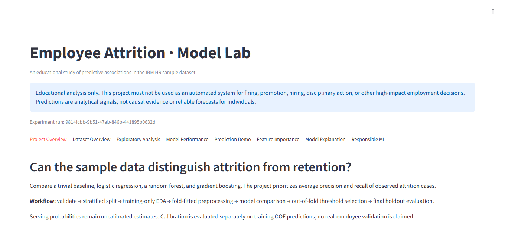
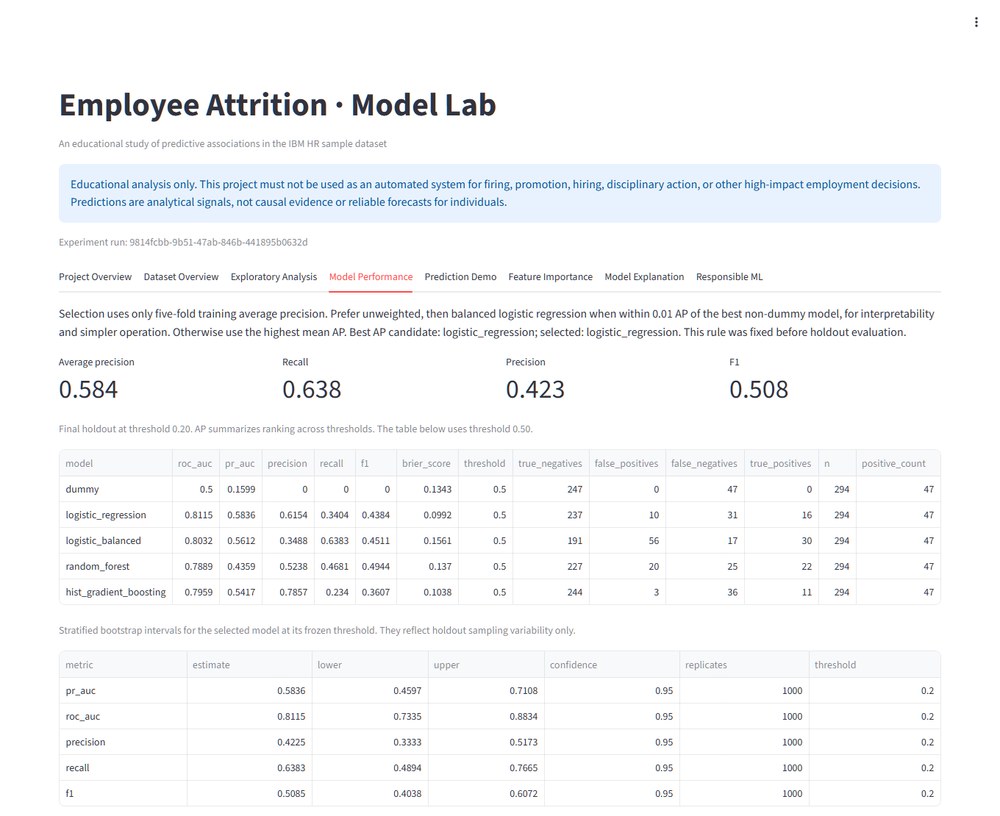

# Serving and operations

[← Back to README](../README.md)

Running the API, the dashboard, and the container, and operating the versioned model bundles.

## API usage

```bash
python -m uvicorn app.api:app --host 127.0.0.1 --port 8000
```

Visit `http://127.0.0.1:8000/docs` for the complete Pydantic/OpenAPI schema. `GET /` describes the service; `GET /health` returns status and model availability, with HTTP 503 if the artifact cannot load. `POST /predict` accepts a single employee object with all 30 predictor keys. Numeric fields are strict whole numbers with bounds; categories are nonempty strings. Fields can explicitly be null for imputation, but missing or extra keys fail with HTTP 422. Novel categories are accepted and encoded as unseen values; they may reduce reliability.

```bash
curl -X POST http://127.0.0.1:8000/predict -H "Content-Type: application/json" --data-binary @examples/employee.json
```

PowerShell equivalent:

```powershell
Invoke-RestMethod -Uri http://127.0.0.1:8000/predict -Method Post -ContentType 'application/json' -Body (Get-Content examples/employee.json -Raw)
```

Responses contain `prediction` (Yes/No), `attrition_probability`, `threshold`, and nullable `run_id`, populated from the actual model. Health responses also identify the loaded run; explicit legacy schema-1 artifacts return null. No mock probabilities are served.

`POST /predict/batch` accepts `{"employees": [...]}` with 1 to 1,000 employee objects using the same per-record schema, and returns `count` plus `predictions` in request order. `GET /model` reports the API version, run ID, selected model, decision threshold, feature count, training rows, dataset hash, pinned package versions, and the frozen holdout metrics of the loaded bundle (null metrics for an explicit legacy file).

Every response carries an `X-Request-ID` header: a safe caller-supplied value (letters, digits, `.`, `_`, `-`, at most 64 characters) is echoed, otherwise one is generated. The `app.api` logger records request ID, method, path, status, and duration only, never request bodies. Set `ATTRITION_API_KEY` before starting the server to require a matching `X-API-Key` header on `/model`, `/predict`, and `/predict/batch`; `/` and `/health` stay open for probes. The Python module accepts a dictionary or DataFrame and returns `predicted_class`, `attrition_probability`, `decision_threshold`, and nullable `run_id`; a DataFrame yields a list in row order.

```bash
python -m attrition.models.predict examples/employee.json
```

The model loads once during API startup; restart after retraining. Requests log event/count information without raw profiles. Joblib artifacts must come from a trusted source because pickle-based loading can execute code. The optional shared API key is a basic demo guard, not production identity, authorization, rate limiting, or TLS; deploy behind proper access controls.

### Example responses

Captured from a local run of the current model; `run_id` changes with every training run.

`POST /predict` with [`examples/employee.json`](../examples/employee.json):

```json
{"prediction": "No", "attrition_probability": 0.004045697721405301, "threshold": 0.2, "run_id": "60d37a55-5c15-47fa-a961-d99776beef18"}
```

`POST /predict/batch` with that profile and a copy changed to `"OverTime": "Yes", "JobSatisfaction": 1`, sent with `X-Request-ID: docs-example-1` (echoed in the response header):

```json
{
  "count": 2,
  "predictions": [
    {"prediction": "No", "attrition_probability": 0.0040456977214052975, "threshold": 0.2, "run_id": "60d37a55-5c15-47fa-a961-d99776beef18"},
    {"prediction": "No", "attrition_probability": 0.03593143779864496, "threshold": 0.2, "run_id": "60d37a55-5c15-47fa-a961-d99776beef18"}
  ]
}
```

Single and batch probabilities can differ in the last floating-point digits because rows are scored together.

`GET /model`:

```json
{
  "api_version": "1.1.0",
  "run_id": "60d37a55-5c15-47fa-a961-d99776beef18",
  "schema_version": 2,
  "selected_model": "logistic_regression",
  "decision_threshold": 0.2,
  "feature_count": 30,
  "train_rows": 1176,
  "data_sha256": "e9f55fbf0a5c058306225d131311e135379d82ad0c94c33738ec75b9a179db9c",
  "package_versions": {"numpy": "2.5.3", "pandas": "3.0.6", "scikit-learn": "1.8.0", "joblib": "1.6.0"},
  "holdout_metrics": {
    "pr_auc": 0.5836342531326222, "roc_auc": 0.8115255405289, "precision": 0.4225352112676056,
    "recall": 0.6382978723404256, "f1": 0.5084745762711864, "brier_score": 0.09918620635299684,
    "threshold": 0.2, "n": 294, "positive_count": 47
  }
}
```

`POST /predict` with only `{"Age": 30}` returns HTTP 422 with one entry per missing field (29 here), for example:

```json
{"type": "missing", "loc": ["body", "DailyRate"], "msg": "Field required", "input": {"Age": 30}}
```

## Streamlit usage

```bash
python -m streamlit run app/streamlit_app.py
```

Open `http://localhost:8501`. Tabs cover project/dataset overview, training-only EDA, model performance, an editable prediction form, feature importance, model explanation, and responsible ML. The form displays estimated probability first, its threshold-derived class, and the frozen operating threshold. Resources refresh when the active run changes. Model, report, plots, sample input, and explanation background are read from that same verified run.

### Screenshots

Project overview, with the disclaimer and the active run ID:



Model performance: selection rule, frozen holdout metrics at the operating threshold, the model comparison at 0.50, and bootstrap intervals:



Prediction demo: the estimated probability comes first, then the threshold-derived class and the per-feature contributions for the submitted profile:


## Docker usage

```bash
docker build -t employee-attrition-ml .
python -m scripts.verify_container --image employee-attrition-ml
docker run --rm -p 127.0.0.1:8000:8000 employee-attrition-ml
```

The multi-stage Python 3.12 slim image, pinned by digest, trains and verifies a bundle in its builder stage. The final stage installs constrained serving dependencies and copies the verified bundle and serving code. It contains no raw training dataset or training CLI and runs as an unprivileged user with a health check. Building requires a running Linux-container Docker engine and dependency-download access. SHAP is optional and omitted from the default image build.

## Versioned experiment bundles

Training writes a new `models/runs/<UUID>/` directory containing `pipeline.joblib`, `metadata.json`, metrics, figures, processed diagnostics, `employee.json`, `background.json`, `reference_profile.json`, and a checksum manifest. The pipeline and report use schema version 2 and the same `run_id`. All files and metadata are verified before atomically replacing `models/current.json`. Failed training or publication leaves the previous active run available.

API startup resolves and loads one run for its process lifetime; restart it after retraining. Each dashboard rerun resolves one active run, and caches that immutable bundle by its UUID. It never combines a model from one run with reports from another. Checksums detect accidental corruption and mixing; they do not make untrusted joblib/pickle safe.

Each training run adds a bundle. `python -m attrition.models.prune --keep 5` removes all but the five most recently written runs and never removes the active run; add `--dry-run` to list what would be removed. Only UUID-named run folders are considered, and an unverifiable `current.json` stops pruning without deleting anything. A running API keeps serving the bundle it loaded at startup.

The existing `reports/`, `data/processed/`, and `examples/` paths remain reproducible exports. Git reports omit runtime UUIDs. Schema-1 files can still be loaded explicitly with `python -m attrition.models.predict examples/employee.json --model <file>.joblib`. Pickles record module paths, so artifacts trained before the package moved from `src` to `attrition` fail with a clear "retrain" error; run `python -m attrition.models.train` to replace them.

## Input drift monitoring

Each bundle stores `reference_profile.json`: training-row deciles for numeric features, category shares, and missing rates. The drift check compares new records with that profile using the Population Stability Index (PSI) per feature:

```bash
python -m attrition.monitoring.drift new_records.csv --output reports/drift.csv
python -m attrition.monitoring.drift batch.json --fail-on-shift   # exit status 1 if any feature shifts
```

Input can be CSV or JSON (one object, a list, or the `{"employees": [...]}` body used by `/predict/batch`) and must pass the same schema validation as prediction. Status follows common PSI conventions: below 0.10 stable, 0.10 to 0.25 moderate, 0.25 or more shift. Unseen categories form their own bin and are reported as `unseen_share`; missing values are excluded from PSI and reported as missing rates. Below 100 records, PSI mostly reflects sampling noise and the command warns. Drift shows that inputs differ from training data; it does not show that predictions are wrong or that attrition rates changed, which requires labeled outcomes.
