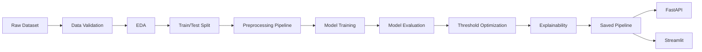

# End-to-End Employee Attrition Machine Learning Project

You are an expert Machine Learning Engineer and Data Scientist.

Build a complete, portfolio-quality, end-to-end machine learning project for predicting employee attrition using the IBM HR Employee Attrition dataset.

The dataset file is:

```text
WA_Fn-UseC_-HR-Employee-Attrition.csv
```

The target column is:

```text
Attrition
```

where:

```text
Yes = employee attrition
No  = employee retention
```

The project must demonstrate a realistic machine learning workflow from raw data analysis through model deployment.

---

# 1. Project Objective

The main objective is to build a machine learning system that predicts the probability of employee attrition based on employee-related attributes.

The project should answer two different questions:

1. Can employee attrition be predicted from available HR data?
2. Which features are most strongly associated with model predictions of employee attrition?

Important:

Do not claim that predictive features are necessarily causal factors.

Use terminology such as:

```text
associated with attrition
related to attrition
important predictive features
contributing to model predictions
```

Avoid claims such as:

```text
causes attrition
causes employees to resign
```

unless causal evidence exists.

---

# 2. Dataset Characteristics

The dataset contains approximately:

```text
1,470 rows
35 columns
```

The target distribution is imbalanced, with approximately:

```text
Attrition = No  ~84%
Attrition = Yes ~16%
```

Therefore:

Accuracy must NOT be used as the primary evaluation metric.

The project should focus on:

```text
Precision
Recall
F1-score
ROC-AUC
PR-AUC
Confusion Matrix
```

PR-AUC and Recall for the positive class should receive particular attention.

---

# 3. Repository Structure

Create the project using the following structure:

```text
employee-attrition-ml/
│
├── data/
│   ├── raw/
│   │   └── WA_Fn-UseC_-HR-Employee-Attrition.csv
│   └── processed/
│
├── notebooks/
│   ├── 01_data_understanding.ipynb
│   ├── 02_exploratory_data_analysis.ipynb
│   ├── 03_feature_engineering.ipynb
│   └── 04_model_experiments.ipynb
│
├── src/
│   ├── __init__.py
│   ├── config.py
│   │
│   ├── data/
│   │   ├── __init__.py
│   │   ├── load_data.py
│   │   └── validate_data.py
│   │
│   ├── features/
│   │   ├── __init__.py
│   │   └── preprocess.py
│   │
│   ├── models/
│   │   ├── __init__.py
│   │   ├── train.py
│   │   ├── evaluate.py
│   │   ├── threshold.py
│   │   └── predict.py
│   │
│   └── visualization/
│       ├── __init__.py
│       └── plots.py
│
├── models/
│   └── .gitkeep
│
├── reports/
│   ├── figures/
│   └── metrics/
│
├── app/
│   ├── api.py
│   └── streamlit_app.py
│
├── tests/
│   ├── test_preprocessing.py
│   ├── test_prediction.py
│   └── test_api.py
│
├── requirements.txt
├── .gitignore
├── Dockerfile
├── README.md
└── Makefile
```

Keep notebooks for exploration only.

Reusable logic must live inside `src/`.

Do not implement the entire project inside notebooks.

---

# 4. Technology Stack

Use Python.

Primary libraries:

```text
pandas
numpy
scikit-learn
matplotlib
joblib
shap
fastapi
uvicorn
streamlit
pydantic
pytest
```

Optional:

```text
xgboost
```

Use XGBoost only if it is available and adds value.

The core project must still work without XGBoost.

---

# 5. Data Loading

Create reusable data-loading utilities.

The code must:

- load the CSV safely
- validate whether the required target column exists
- display or log dataset shape
- identify numerical and categorical columns
- detect duplicated rows
- detect missing values
- detect constant columns

Do not mutate the raw dataset.

---

# 6. Data Validation

Create validation logic that checks:

```text
required columns
target column values
duplicate rows
missing values
constant columns
data types
unexpected categorical values
```

Fail clearly when invalid data is provided.

Use readable error messages.

---

# 7. Initial Data Cleaning

Investigate whether the following columns are constant:

```text
EmployeeCount
Over18
StandardHours
```

If confirmed constant, remove them from the predictive feature set.

Also exclude:

```text
EmployeeNumber
```

because it behaves like an identifier rather than a meaningful predictive feature.

Do not silently remove columns.

Document every excluded feature and explain why.

---

# 8. Exploratory Data Analysis

Create an EDA notebook.

The analysis should include:

```text
dataset shape
column types
missing values
duplicates
summary statistics
target distribution
categorical distributions
numeric distributions
outlier inspection
feature vs target analysis
correlation analysis for numerical variables
```

Investigate relationships between `Attrition` and features such as:

```text
Age
BusinessTravel
DailyRate
Department
DistanceFromHome
Education
EducationField
EnvironmentSatisfaction
Gender
HourlyRate
JobInvolvement
JobLevel
JobRole
JobSatisfaction
MaritalStatus
MonthlyIncome
MonthlyRate
NumCompaniesWorked
OverTime
PercentSalaryHike
PerformanceRating
RelationshipSatisfaction
StockOptionLevel
TotalWorkingYears
TrainingTimesLastYear
WorkLifeBalance
YearsAtCompany
YearsInCurrentRole
YearsSinceLastPromotion
YearsWithCurrManager
```

Create meaningful visualizations.

Prefer readable plots over excessive visualization.

Focus on business interpretation.

---

# 9. Data Leakage Prevention

Explicitly check for data leakage.

Do not perform preprocessing on the entire dataset before splitting.

The correct workflow must be:

```text
raw data
↓
train/test split
↓
fit preprocessing on training data only
↓
transform training and test data
```

Use `Pipeline` and `ColumnTransformer` whenever possible.

---

# 10. Train/Test Split

Create a stratified train/test split.

Recommended:

```python
train_test_split(
    X,
    y,
    test_size=0.20,
    stratify=y,
    random_state=42,
)
```

Convert the target to binary format:

```text
Yes -> 1
No  -> 0
```

Keep this mapping explicit.

---

# 11. Feature Preprocessing

Automatically separate:

```text
numerical columns
categorical columns
```

Create a reusable scikit-learn `ColumnTransformer`.

Numerical preprocessing should include appropriate handling such as:

```text
imputation if needed
scaling when required
```

Categorical preprocessing should include:

```text
imputation if needed
OneHotEncoder(handle_unknown="ignore")
```

Ensure the preprocessing pipeline can handle unseen categories during inference.

---

# 12. Baseline Model

Train a baseline model using:

```text
DummyClassifier
```

Use an appropriate strategy.

The baseline exists to show whether real models outperform trivial prediction.

Report its metrics.

---

# 13. Logistic Regression

Train Logistic Regression as the primary interpretable model.

Consider:

```text
class_weight="balanced"
```

Compare with a version without class weighting if useful.

Evaluate:

```text
Precision
Recall
F1
ROC-AUC
PR-AUC
Confusion Matrix
```

Also inspect coefficients after preprocessing.

Create a human-readable table of the most influential positive and negative coefficients.

---

# 14. Tree-Based Model

Train at least one tree-based model.

Use:

```text
RandomForestClassifier
```

Consider parameters suitable for a small dataset.

Avoid excessive overfitting.

If appropriate, include:

```text
class_weight="balanced"
```

Evaluate using the same metrics as Logistic Regression.

---

# 15. Gradient Boosting

Add one gradient boosting model.

Preferred options:

```text
HistGradientBoostingClassifier
GradientBoostingClassifier
```

Optionally use:

```text
XGBoost
```

if installed.

Do not make the project dependent on XGBoost.

---

# 16. Cross Validation

For model comparison, use stratified cross-validation.

Recommended:

```text
StratifiedKFold
```

Use approximately:

```text
5 folds
```

Evaluate models using multiple metrics.

At minimum:

```text
ROC-AUC
Average Precision / PR-AUC
F1
Recall
```

Report mean and standard deviation.

---

# 17. Model Comparison

Create a model comparison table similar to:

```text
Model
ROC-AUC
PR-AUC
Precision
Recall
F1
```

Do not select the model purely based on accuracy.

Choose the final model based on:

```text
performance
generalization
interpretability
operational usefulness
```

Explain the trade-offs.

---

# 18. Threshold Optimization

Do not assume:

```text
threshold = 0.50
```

is automatically optimal.

Create a threshold analysis.

Test several thresholds such as:

```text
0.20
0.25
0.30
0.35
0.40
0.45
0.50
```

For each threshold calculate:

```text
Precision
Recall
F1
False Positives
False Negatives
```

Plot:

```text
Precision vs Recall vs Threshold
```

Select a reasonable operating threshold.

Explain that threshold selection depends on business costs.

For example:

Missing an employee likely to leave may have a different business cost than incorrectly flagging an employee as at risk.

---

# 19. Confusion Matrix Analysis

For the selected model and threshold, explain:

```text
True Positive
True Negative
False Positive
False Negative
```

in business terms.

Example:

```text
False Negative:
The model predicts retention, but the employee belongs to the attrition class.
```

Discuss why false negatives may be particularly important.

---

# 20. ROC and Precision-Recall Curves

Generate:

```text
ROC curve
Precision-Recall curve
```

Compare major models on these curves.

Store figures in:

```text
reports/figures/
```

---

# 21. Feature Importance

For supported models, generate feature importance.

Use:

```text
model coefficients
feature_importances_
permutation importance
```

depending on the model.

Map transformed feature names back to readable feature names.

Do not show anonymous feature indices.

---

# 22. SHAP Explainability

If supported cleanly, use SHAP.

Provide:

```text
global SHAP importance
SHAP summary plot
individual prediction explanation
```

The goal is to explain why a model produces a particular probability.

If SHAP causes unnecessary compatibility complexity, keep the implementation optional and clearly separated.

---

# 23. Fairness and Responsible ML

Because this is an HR dataset, include a Responsible ML section.

At minimum discuss:

```text
Gender
Age
MaritalStatus
```

Do not automatically assume these features should be used in a real production HR system.

Compare model performance with and without potentially sensitive attributes if practical.

Discuss:

```text
bias risk
proxy variables
fairness
human oversight
ethical use
```

Clearly state:

This project must not be used as an automated system for firing, promotion, hiring, disciplinary action, or other high-impact employment decisions.

Predictions should only be treated as analytical signals in this educational project.

---

# 24. Model Serialization

Serialize the final complete preprocessing + model pipeline.

Use:

```python
joblib
```

Save it as something similar to:

```text
models/attrition_pipeline.joblib
```

The saved object must contain preprocessing and model inference together.

Do not save only the estimator while requiring manual preprocessing.

---

# 25. Prediction Module

Create:

```text
src/models/predict.py
```

It should support predictions from a dictionary or DataFrame.

Return:

```text
predicted_class
attrition_probability
decision_threshold
```

Example output:

```json
{
  "predicted_class": "Yes",
  "attrition_probability": 0.73,
  "decision_threshold": 0.35
}
```

---

# 26. FastAPI API

Create a REST API.

File:

```text
app/api.py
```

Endpoints:

```text
GET /
GET /health
POST /predict
```

`GET /health` should confirm:

```text
service status
model availability
```

`POST /predict` should accept employee information using Pydantic schemas.

Example response:

```json
{
  "prediction": "Yes",
  "attrition_probability": 0.73,
  "threshold": 0.35
}
```

Include input validation.

Return useful error messages.

---

# 27. Streamlit Application

Create an interactive Streamlit dashboard.

File:

```text
app/streamlit_app.py
```

The application should contain sections such as:

```text
Project Overview
Dataset Overview
Exploratory Analysis
Model Performance
Prediction Demo
Feature Importance
Model Explanation
Responsible ML Disclaimer
```

For the prediction demo:

Allow the user to input employee characteristics.

Display:

```text
Attrition probability
Predicted class
Selected threshold
```

Avoid alarming language.

Prefer:

```text
Higher predicted attrition probability
```

instead of:

```text
This employee will resign.
```

---

# 28. Testing

Use `pytest`.

Create tests for at least:

```text
data loading
preprocessing pipeline
prediction function
model serialization
API health endpoint
API prediction endpoint
```

Tests should not depend on manual interaction.

---

# 29. Logging

Use Python's `logging` module.

Avoid unnecessary `print()` statements in production modules.

Log events such as:

```text
data loaded
model training started
model training completed
model saved
prediction request received
```

Do not log sensitive raw user input unnecessarily.

---

# 30. Configuration

Create:

```text
src/config.py
```

Centralize values such as:

```text
random seed
dataset path
model path
test size
target column
default threshold
```

Avoid duplicating constants across files.

---

# 31. Reproducibility

Set:

```text
random_state = 42
```

where applicable.

Make model training reproducible.

Document package dependencies in:

```text
requirements.txt
```

---

# 32. Docker

Create a Dockerfile capable of running the FastAPI service.

Use a lightweight Python base image.

Example runtime:

```text
uvicorn app.api:app --host 0.0.0.0 --port 8000
```

Keep the Dockerfile simple and understandable.

---

# 33. Makefile

Create useful commands such as:

```text
make install
make train
make test
make api
make app
```

Example behavior:

```text
make train
```

should execute the model training pipeline.

---

# 34. README

Create a professional GitHub README.

Include:

```text
Project Overview
Business Problem
Dataset
Project Architecture
Repository Structure
Installation
EDA Highlights
Modeling Approach
Evaluation Metrics
Model Comparison
Threshold Selection
Explainability
Responsible AI Considerations
API Usage
Streamlit Usage
Docker Usage
Testing
Limitations
Future Improvements
```

Include diagrams using Mermaid where appropriate.

Example pipeline:



---

# 35. README Model Results

Do not hard-code fake metrics.

Metrics must come from actual model execution.

If results have not been generated yet, use placeholders or generate them programmatically.

Never invent performance numbers.

---

# 36. Coding Standards

Follow these principles:

```text
PEP 8
type hints
docstrings
modular functions
clear naming
separation of concerns
DRY principles
simple implementations
```

Avoid unnecessary abstractions.

Do not over-engineer the project.

---

# 37. Notebook Standards

Each notebook should have:

```text
clear markdown headings
business context
code explanations
plots
written interpretation
conclusions
```

Do not create notebooks containing only code cells.

At the end of each notebook include:

```text
Key Findings
Next Steps
```

---

# 38. EDA Interpretation

When interpreting charts, write concise observations.

Example:

```text
Employees working overtime show a higher observed attrition rate in this dataset.
```

Do not write:

```text
Overtime causes employee attrition.
```

Maintain this distinction throughout the project.

---

# 39. Model Training CLI

Make training executable from the command line.

For example:

```bash
python -m src.models.train
```

The command should:

```text
load the dataset
validate the data
split the data
build preprocessing
train candidate models
evaluate models
select the final model
perform threshold analysis
save metrics
save figures
save the final pipeline
```

---

# 40. Metrics Output

Store evaluation metrics in machine-readable format.

For example:

```text
reports/metrics/model_metrics.json
```

Example structure:

```json
{
  "logistic_regression": {
    "roc_auc": 0.0,
    "pr_auc": 0.0,
    "precision": 0.0,
    "recall": 0.0,
    "f1": 0.0
  }
}
```

Populate the file with actual results.

---

# 41. Generated Figures

Automatically save important figures.

Examples:

```text
attrition_distribution.png
roc_curve.png
precision_recall_curve.png
confusion_matrix.png
threshold_analysis.png
feature_importance.png
shap_summary.png
```

Store them under:

```text
reports/figures/
```

---

# 42. Git Ignore

Include:

```text
__pycache__/
.ipynb_checkpoints/
.venv/
venv/
.env
*.pyc
.DS_Store
```

Do not ignore the project source code.

Decide whether trained model artifacts should be committed, and document the decision.

---

# 43. Future Improvements

Include realistic future work such as:

```text
hyperparameter optimization
model calibration
fairness metrics
feature drift monitoring
data drift monitoring
MLflow experiment tracking
DVC
CI/CD
cloud deployment
database-backed inference logging
monitoring
scheduled retraining
```

Do not implement unnecessary infrastructure unless required.

---

# 44. Final Deliverable Expectations

The final repository should demonstrate the following ML lifecycle:

```text
Raw CSV
    ↓
Data Validation
    ↓
Exploratory Data Analysis
    ↓
Feature Engineering
    ↓
Preprocessing Pipeline
    ↓
Baseline Model
    ↓
Logistic Regression
    ↓
Random Forest
    ↓
Gradient Boosting
    ↓
Cross Validation
    ↓
Model Comparison
    ↓
Threshold Optimization
    ↓
Explainability
    ↓
Responsible ML Review
    ↓
Serialized Model Pipeline
    ↓
FastAPI
    ↓
Streamlit
    ↓
Docker
    ↓
Tests
```

The codebase should look like a serious junior-to-mid-level Machine Learning Engineer portfolio project rather than a tutorial notebook.

---

# 45. Implementation Strategy

Do not attempt to create poorly integrated code all at once.

Implement the repository incrementally in this order:

```text
1. Repository structure
2. Data loading
3. Data validation
4. EDA notebook
5. Preprocessing pipeline
6. Baseline model
7. Logistic regression
8. Random forest
9. Gradient boosting
10. Evaluation utilities
11. Cross validation
12. Threshold tuning
13. Explainability
14. Final model serialization
15. Prediction module
16. FastAPI
17. Streamlit
18. Tests
19. Docker
20. README
```

After each major stage:

- verify imports
- run relevant code
- fix errors
- keep the project executable

Do not leave obviously broken placeholder code.

---

# 46. Important Modeling Principles

Follow these principles throughout the project:

1. Prevent data leakage.
2. Fit preprocessing only on training data.
3. Use stratification because the target is imbalanced.
4. Do not optimize for accuracy alone.
5. Keep preprocessing and inference inside the same pipeline.
6. Compare multiple models.
7. Use an interpretable baseline.
8. Tune the classification threshold separately from model training.
9. Never invent evaluation results.
10. Treat model explanations as associations, not causal evidence.
11. Document limitations.
12. Keep the project reproducible.

---

# 47. Dataset-Specific Investigation

Before modeling, explicitly investigate:

```text
EmployeeCount
Over18
StandardHours
EmployeeNumber
```

Determine which should be removed.

Also examine potentially redundant or strongly related variables such as:

```text
JobLevel
MonthlyIncome
TotalWorkingYears
YearsAtCompany
YearsInCurrentRole
YearsWithCurrManager
```

Do not automatically remove correlated variables.

Investigate their effect first.

---

# 48. Class Imbalance Strategy

Start with simple techniques.

Prefer:

```text
class_weight
threshold optimization
appropriate evaluation metrics
```

Do not immediately apply SMOTE.

If SMOTE is tested later:

- apply it only inside the training pipeline
- never oversample before train/test splitting
- compare it against non-SMOTE approaches

Document whether it actually improves validation performance.

---

# 49. Prediction Philosophy

The model output should primarily be treated as a probability.

Prefer:

```text
Attrition probability: 0.67
```

over overly deterministic statements.

The classification label should be derived from the selected threshold.

---

# 50. Final Quality Check

Before considering the repository complete, verify:

```text
training runs from a clean environment
tests pass
model file is generated
FastAPI loads the model
/predict works
Streamlit loads
README commands are correct
paths are cross-platform
there are no hard-coded local absolute paths
no fake metrics exist
no obvious data leakage exists
```

Perform a final code review and fix any inconsistencies.

The final result should be clean, reproducible, educational, technically correct, and suitable for showcasing on GitHub as an end-to-end machine learning portfolio project.